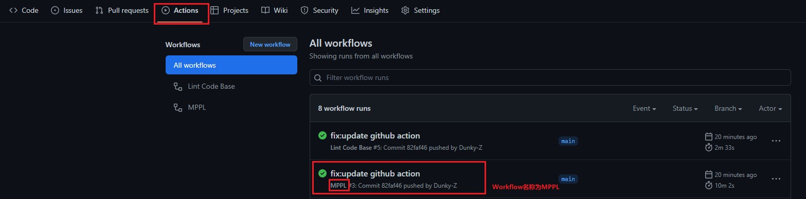

# RISC-V 指令集手册 - 中文

## 获取 PDF

该项目已配置 GitHub Action，可以在 Action 中下载 Artifacts。具体路径如下：



打开页面底端找到`Artifacts-output`。下载`output`解压即可。

## 手动构建 PDF

> 因为 PDF 不方便版本管理，所以未将其添加，需要安装[pandoc](https://github.com/jgm/pandoc)并手动构建。

### Linux

```bash
mkdir build
cd src
pandoc -f  markdown-auto_identifiers --pdf-engine=xelatex   --template=../templates/mppl.tex -s --listings ./*.md -o ../build/RISC-V指令集手册-中文
```

### Windows

```bash
md build
cd src
pandoc.exe -f  markdown-auto_identifiers --pdf-engine=xelatex   --template=../templates/mppl.tex -s --listings 1-Introduction.md 2-Overview.md  -o ../build/RISC-V指令集手册-中文
```
