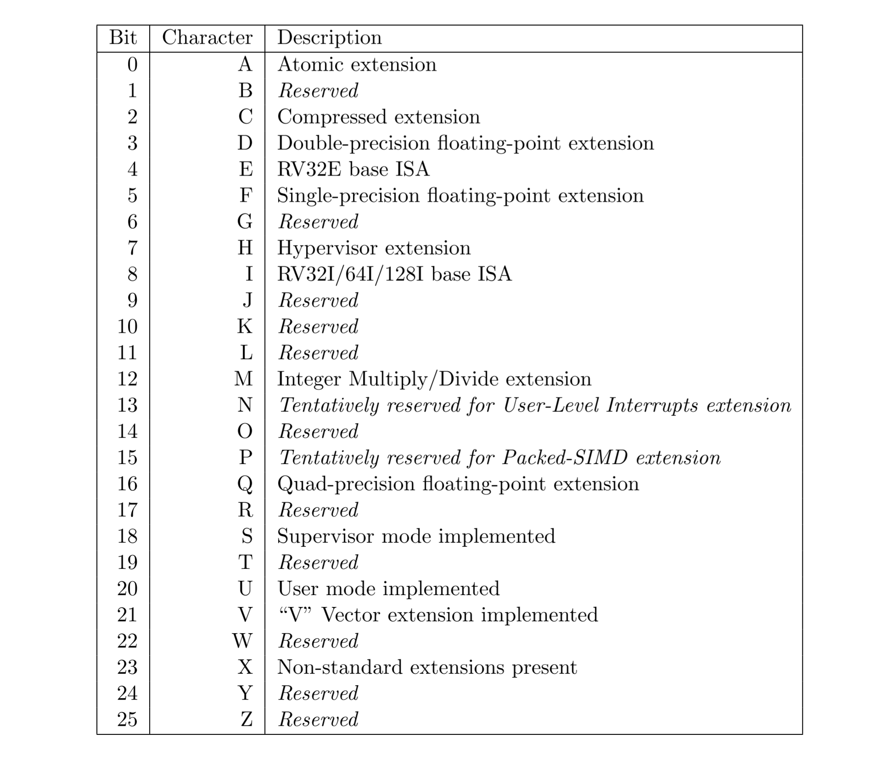
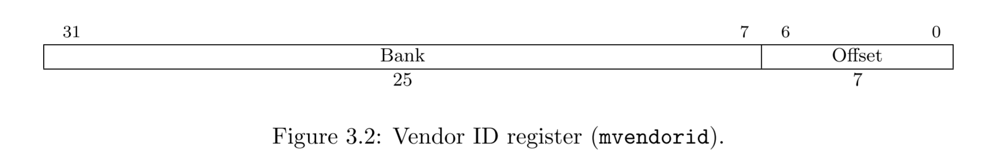
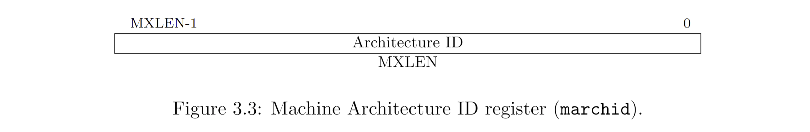
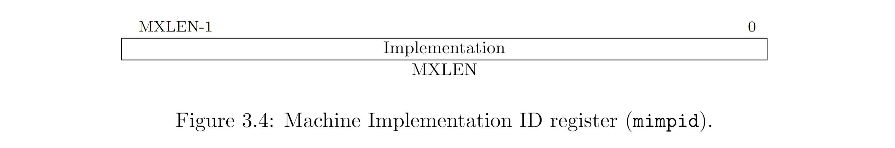
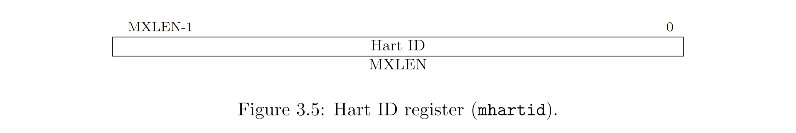
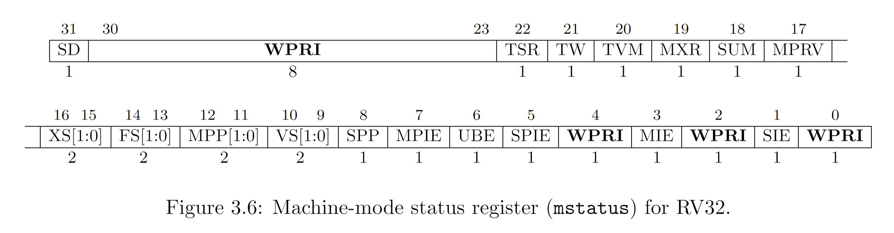
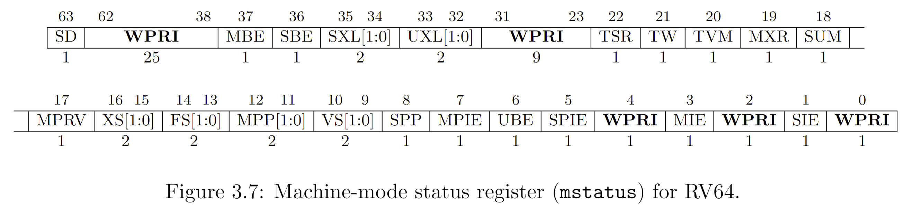
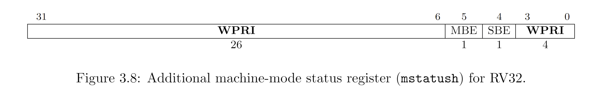
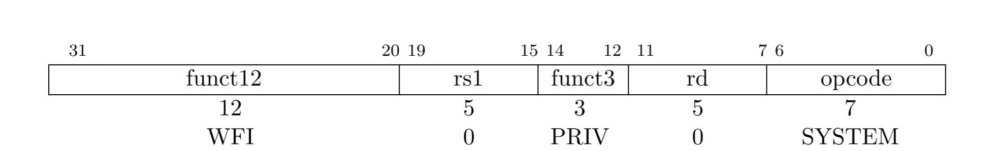

# Machine-Level ISA, Version 1.12

本章介绍了机器模式（M-mode）中可用的机器级操作，这是 RISC-V 系统中最高权限的模式。M 模式用于对硬件平台的低级访问，是复位时进入的第一个模式。M 模式也可以用来实现那些在硬件中直接实现过于困难或成本高昂的功能。RISC-V 的机器级 ISA 包含一个共同的核心，根据支持的其他权限级别和硬件实现的其他细节来扩展。

## Machine-Level CSRs

除了本节中描述的机器级 CSRs 外，M-mode 代码还可以访问较低特权级别的所有 CSRs。

### Machine ISA Register `misa`

misa CSR 是 WARL 读写寄存器，报告硬件 (hart) 支持的 ISA。该寄存器在任何实现中都必须是可读的，但是可以返回零值以指示未实现 misa 寄存器，这就需要通过一个单独的非标准机制确定 CPU 功能。

")

MXL（机器 XLEN）字段编码本机基本整数 ISA 宽度，如表 3.1 所示。MXL 字段在支持多个基本 ISA 宽度的实现中可能是可写的。M-mode 下的有效 XLEN, MXLEN，由 MXL 的设置给出，如果 misa 为零，则有一个固定的值。重置时，MXL 字段始终设置为最广泛支持的 ISA 变种。

misa CSR 为 MXLEN 位宽。如果从 misa 读取的值不为零，该值的 MXL 字段总是表示当前的 MXLEN。如果对 misa 的写操作导致 MXLEN 发生更改，则 MXL 的位置将以新的宽度移动到 misa 的最高有效两位。

> 可以使用返回的 misa 值的符号上的分支，以及可能在符号上左移一个分支和第二个分支，来快速确定基本宽度。这些检查可以用汇编代码编写，而无需知道机器的寄存器宽度（XLEN）。基本宽度由 XLEN = 2^(MXL + 4) 给出。如果 misa 为零，则可以通过将立即数 4 放置在一个寄存器中，然后一次将寄存器左移 31 位来找到基本宽度。如果在一次移位后为零，则该机器为 RV32。如果两次移位后为零，则机器为 RV64，否则为 RV128。

Extensions 字段编码标准扩展的存在，每个字母使用一个位（位 0 表示扩展"A"的存在，位 1 表示扩展"B"的存在，一直到位 25 表示"Z"的存在）。 "I"位将在 RV32I，RV64I，RV128I 基本 ISA 中设置，"E"位将在 RV32E 中设置。Extensions 字段是一个 WARL 字段，可以包含可写位，只要实现允许修改支持的 ISA。在复位时，Extensions 字段应包含最大支持扩展集，如果两者都可用，则应选择 I 而不是 E。

当通过在 misa 中清除其位来禁用标准扩展时，由扩展定义或修改的指令和 CSR 将恢复到其定义或保留的行为，就好像未实现该扩展一样。

Table 3.2: 在 misa 中 Extensions 字段的编码。所有保留用于未来的位，在读取时必须返回零。

RV128I 基本 ISA 的设计尚未完成，尽管本规范的其余部分预计适用于 RV128，但本文档的这个版本仅关注 RV32 和 RV64。

如果支持用户模式和监管者模式，则将设置"U"和"S"位。如果有任何非标准扩展，则将设置"X"位。

> MISA CSR 暴露了一系列基本的 CPU 功能给机器模式代码。通过探测其他机器寄存器以及在系统启动过程中检查其他 ROM 存储，可以获得更详细的信息。

> 我们要求低特权级别执行环境调用而不是读取 CPU 寄存器来确定每个特权级别可用的功能。这使虚拟化层能够改变任何级别观察到的 ISA，并支持更丰富的命令界面而不会加重硬件设计。

"E" 位是只读的。除非将 misa 硬连线为零，否则"E"位始终读取为"I"位的补码（补集？）。同时支持 RV32E 和 RV32I 的实现可以通过清除"I"位来选择 RV32E。

如果 ISA 功能 x 依赖 ISA 功能 y，则尝试启用功能 x 但禁用功能 y 会导致两个功能都被禁用。例如，设置"F" = 0 和"D" = 1 会导致同时清除"F"和"D"。

具体实现可能会在 2 或多个 misa 字段的集体设置上施加额外约束，此时将它们的集体看作是一个 WARL 字段。试图向其中写入一个不支持的组合会导致这些 bits 被置为某个支持的组合。

写 misa 可能会增加 IALIGN，例如，通过禁用 C 扩展。如果要写入 misa 的指令增加了 IALIGN，而后一条指令的地址未按 IALIGN 位对齐，则将抑制对 misa 的写入，从而使 misa 保持不变。

在软件启用一个之前被禁用的扩展时，除该扩展另有规定（specified），否则所有单独与该扩展有关的状态都将是未指定的（unspecified）。

### Machine Vendor ID Register `mvendorid`

`mvendorid` CSR 是一个 32 位只读寄存器，提供内核供应商的 JEDEC 制造商 ID。此寄存器在任何实现中都必须是可读的，但可以返回 0，表示该字段未实现或这是非商业实现。

JEDEC 制造商 ID 通常编码为单字节连续的 `0x7f` 代码的序列，以不等于 `0x7f` 的单字节 ID 终止，并且在每个字节的最高有效位中带有奇校验位。`mvendorid` 在 Bank 字段中编码单字节的连续代码，并在 `Offset` 字段中编码最后一个字节，丢弃奇偶校验位。例如，JEDEC 制造商 ID `0x7f 0x7f 0x7f 0x7f 0x7f 0x7f 0x7f 0x7f 0x7f 0x7f 0x7f 0x7f 0x8a`（十二个连续代码，后跟 0x8a）将在 mvendorid 字段中编码为 `0x60a`。

> 译者注：JEDEC 固态技术协会（JEDEC Solid State Technology Association）是固态及半导体工业界的一个标准化组织，它由约 300 家公司成员组成，约 3300 名技术人员通过 50 个不同的委员会运作，制定固态电子方面的工业标准。JEDEC 曾经是电子工业联盟（EIA）的一部分：联合电子设备工程委员会（Joint Electron Device Engineering Council，JEDEC）。该协会制定了一个制造商标识码的标准：[Standard Manufacturer’s Identification Code](http://www.softnology.biz/pdf/JEP106AV.pdf)，通过读取`mvendorid`寄存器值，查阅该标准即可确定制造商。

> 注：用 JEDEC 的话来说，Bank 编号比 Continuation 的数量大 1；因此，mvendorid Bank 字段编码的值比 JEDEC Bank 编号小一。

> 注：以前，供应商 ID 是 RISC-V 基金会分配的编号，但这与 JEDEC 在维护制造商 ID 标准方面的工作重复。在撰写本文时，向 JEDEC 注册制造商 ID 的一次性费用为 500 美元。

### 机器架构 ID 寄存器 marchid

CSR marchid 是一个 MXLEN 位只读寄存器，用于编码 hart 的基本微架构。此寄存器必须可读，但可以返回值 0 以表示不实现该字段。`mvendorid` 和 `marchid` 的组合应能唯一标识所实现的 hart 微架构类型。

RISC-V International 全球分配开源项目架构 ID，具有非零的架构 ID，并且最高有效位（MSB）为零。商业架构 ID 由每个商业供应商独立分配，但必须设置 MSB，并且在剩余的 MXLEN-1 位中不能包含零。

> 意图是让架构 ID 表示与开发相关的 repo 相关联的微架构，而不是特定组织。商业开源设计的商业制造应（并且可能根据许可证要求）保留原始架构 ID。这将有助于减少碎片化和工具支持成本，并且提供归属权。开源架构 ID 由 RISC-V International 管理，应仅分配给发布的、可运行的开源项目。商业架构 ID 可以由任何注册供应商独立管理，但必须具有与开源架构 ID（设置 MSB）不相交的 ID，以防止如果供应商希望使用闭源和开源微架构时发生冲突。

> 以下 Implementation 字段采用的约定可用于区分同一架构设计的分支，包括按组织。misa 寄存器还有助于区分不同设计的变体。

### 机器实现 ID 寄存器 mimpid

mimpid CSR 提供了处理器实现版本的独特编码。这个寄存器在任何实现中都可读，但可以返回值 0 来表示该字段未实现。实现值应反映 RISC-V 处理器本身的设计，而不是任何周围的系统。

> 此字段的格式由架构源代码提供者自行确定，但通常会由标准工具打印出 16 进制字符串，无前导或尾随零，因此可以左对齐（即，从最高有效字节向下填写），使字段对齐到字节边界，以方便人类阅读。

### HART ID 寄存器 mhartid

mhartid CSR 是一个 MXLEN 位只读寄存器，包含运行代码的硬件线程的整数 ID。该寄存器在任何实现中都必须是可读的。在多处理器系统中，Hart ID 可能不一定连续编号，但至少有一个 hart 的 hart ID 必须为零。Hart ID 在执行环境中必须是唯一的。

> 在某些情况下，我们必须确保只有一个 hart 运行某些代码（例如，在重置时），因此需要一个 hart 具有已知的 hart ID 为零。为了提高效率，系统实现者应该尽量减少系统中使用的最大 hart ID 的范围

### 机器状态寄存器 mstatus and mstatush

mstatus 寄存器是一个 MXLEN 位读/写寄存器，其格式如图 3.6（RV32）和图 3.7（RV64）所示。mstatus 寄存器跟踪并控制 hart 的当前运行状态。mstatus 的受限视图出现在 S 级 ISA 中的 sstatus 寄存器。

仅对于 RV32，mstatush 是一个 32 位读/写寄存器，格式如图 3.8 所示。mstatush 的位 30:4 通常包含与 RV64 的 mstatus 的位 62:36 相同的字段。mstatush 中不存在字段 SD、SXL 和 UXL。

#### mstatus 寄存器中的特权和全局中断使能堆栈

### 机器陷阱向量基址寄存器 mtvec

### 机器 Trap 委托寄存器 (medeleg and mideleg)

默认情况下，任何特权级别的所有 Trap 都在机器模式下处理，尽管机器模式处理程序可以使用 MRET 指令（第 3.3.2 节）将 Trap 重定向回适当的级别。

为了提高性能，实现可以在 `medeleg` 和 `mideleg` 中提供单独的读/写位，以指示某些异常和中断应由较低的特权级别直接处理。机器异常委托寄存器（machine exception delegation register,medeleg）和机器中断委托寄存器（machine interrupt
delegation register, mideleg）为 MXLEN 位读写寄存器。

在具有 S-mode 的系统中，`medeleg` 和 `mideleg` 寄存器必须存在，并且在 medeleg 或 mideleg 中设置一个位将在 S-mode 或 U-mode 中发生时将相应的 Trap 委托给 S-mode Trap 处理程序。在没有 S-mode 的系统中，`medeleg` 和 `mideleg` 寄存器不应该存在。

> 在 1.9.1 及更早的版本中，这些寄存器存在但仅在 M 模式或没有 N 系统的 M/U 中硬接线为零。在这些情况下没有理由要求它们返回零，因为 `misa` 寄存器指示它们是否存在。

当 Trap 委托给 S 模式时，将 Trap 原因写入 `scause` 寄存器；`sepc` 寄存器写入捕获 Trap 的指令的虚拟地址；`stval` 寄存器写入异常特定数据；`mstatus` 的 `SPP` 字段写入 trap 时的 active 特权模式；`mstatus` 的 `SPIE` 字段写入 trap 时 `SIE` 字段的值；`mstatus` 的 `SIE` 字段被清除。`mcause`、`mepc` 和 `mtval` 寄存器以及 `mstatus` 的 `MPP` 和 `MPIE` 字段没有写入。

实现可以选择对可委托 Trap 进行子集化，通过向每个位位置写入 `1` 找到支持的可委托位，然后读回 `medeleg` 或 `mideleg` 中的值以查看哪些位位置为 1。

一个实现不应有任何 `medeleg` 位是只读的，即，任何可以委托的同步 Trap 必须支持不被委托。类似地，一个实现不应将对应于机器级中断的 `mideleg` 的任何位固定为只读（但可以为较低级别的中断这样做）。

> 1.11 版及更早版本禁止将 `mideleg` 的任何位设为只读。平台标准可能总是添加此类限制。

Trap 永远不会从特权更高的模式转换到特权更低的模式。例如，如果 M-mode 已将非法指令异常委托给 S-mode，并且 M-mode 软件随后执行了一条非法指令，则 Trap 将在 M-mode 中捕获，而不是委托给 S-mode。相比之下，Trap 可以水平放置。使用相同的示例，如果 M 模式已将非法指令异常委托给 S 模式，并且 S 模式软件稍后执行非法指令，则 Trap 在 S 模式中发生。

委托中断导致中断在委托者特权级别被屏蔽。例如，如果通过设置 `mideleg[5]` 将监控定时器中断 (STI) 委托给 S 模式，则在 M 模式下执行时不会采用 `STI`。相比之下，如果 `mideleg[5]` 清晰，则可以在任何模式下进行 STI，并且无论当前模式如何，都会将控制权转移到 M 模式。

`medeleg` 为第 39 页表 3.6 中所示的每个同步异常分配了一个位位置，位位置的索引等于 `mcause` 寄存器中返回的值（即，设置位 8 允许将用户模式环境调用委托给较低权限的 Trap 处理程序）。

`mideleg` 保存各个中断的 Trap 委托位，位布局与 `mip` 寄存器中的位布局相匹配（即，`STIP` 中断委托控制位于位 5）。对于不能在低特权模式下发生的异常，相应的 `medeleg` 位应该是只读的零。特别是，`medeleg[11]` 是只读零。

### 机器中断寄存器 mip and mie

## Machine-Level Memory-Mapped Registers

## Machine-Mode Privileged Instructions

### Environment Call and Breakpoint

### Trap-Return Instruction

### Wait for Interrupt

等待中断指令 (WFI) 为实现提供了一个提示，即当前的 hart 可以停止，直到需要服务中断。WFI 指令的执行也可以用来通知硬件平台合适的中断应该优先路由到这个 hart。WFI 在所有特权模式下都可用，并且可用于 U 模式 (可选地)。当 mstatus 中的 TW = 1 时，该指令可能会引发非法指令异常，如第 3.1.6.5 节所述。

如果在 hart 停止时存在或稍后出现启用的中断，则中断 trap 将在以下指令上执行，即在 trap 处理程序中恢复执行并且 `mepc = pc + 4`。

### Custom SYSTEM Instructions
